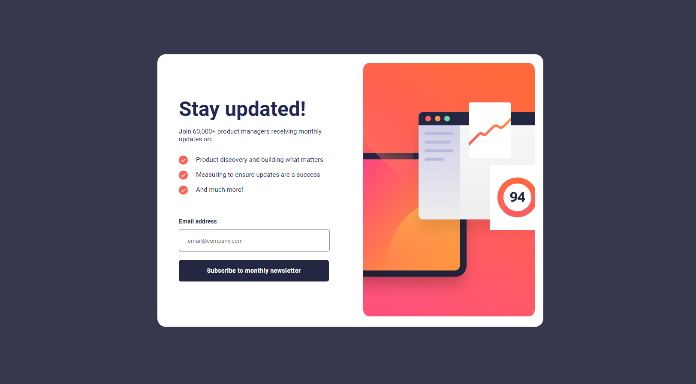
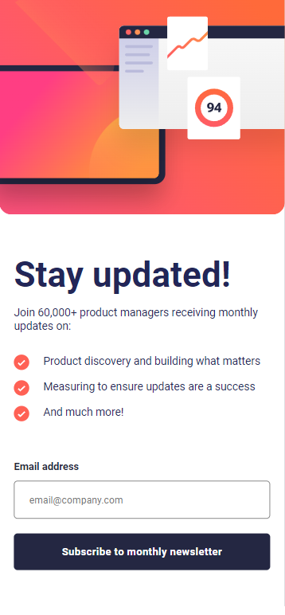
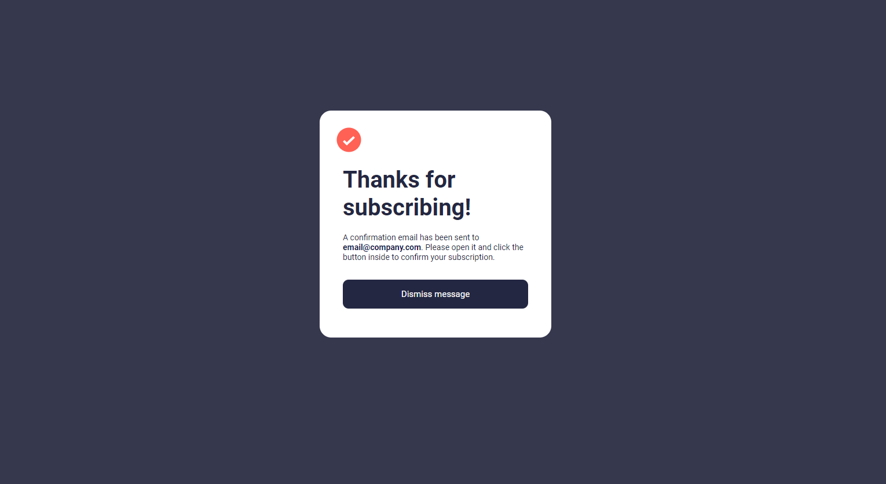
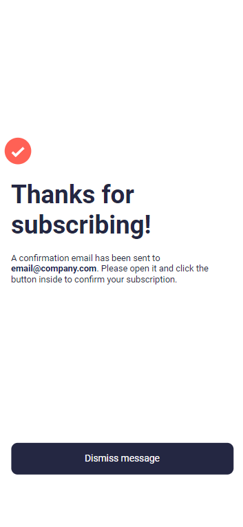

# Frontend Mentor - Newsletter sign-up view

## Table of contents

- [Overview](#overview)
  - [The challenge](#the-challenge)
  - [Screenshots](#screenshots)
  - [Links](#links)
- [My process](#my-process)
  - [What I learned](#what-i-learned)
  - [Possible upgrades](#possible-upgrades)

## Overview

### The challenge

The challenge concerned building out this newsletter sign-up page with success view and getting it looking as close to the design as possible.

### Screenshots

### Links

Solution URL: https://rafalbodanka.github.io/newsletter-signup-success-view/

## My process

### What I learned

During this challenge, I have practiced regex and responsive image assignment with js.

### Possible upgrades

 - Sending real e-mail confirmation.
